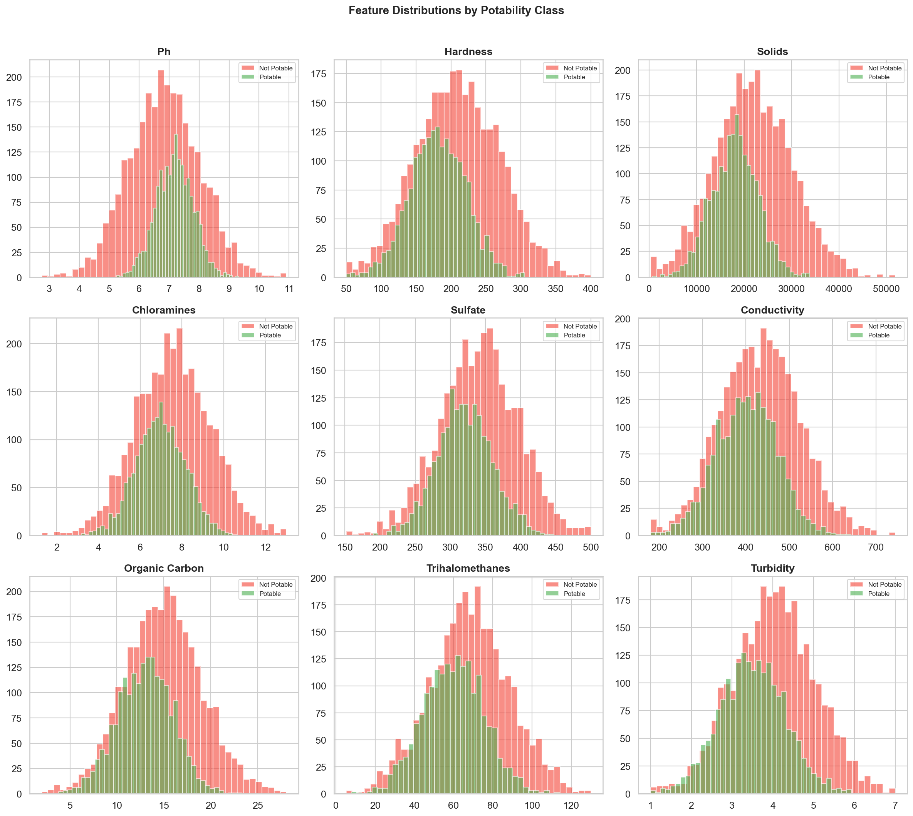
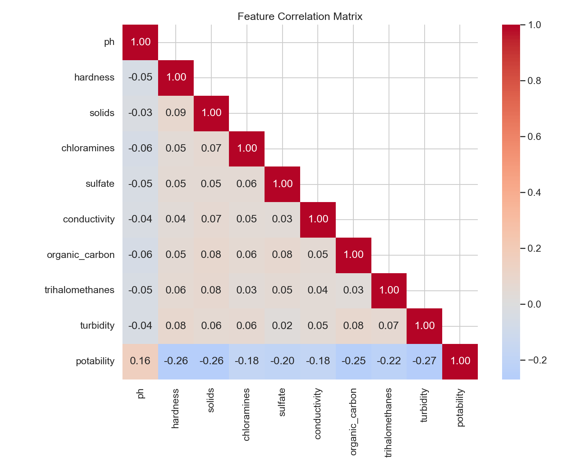
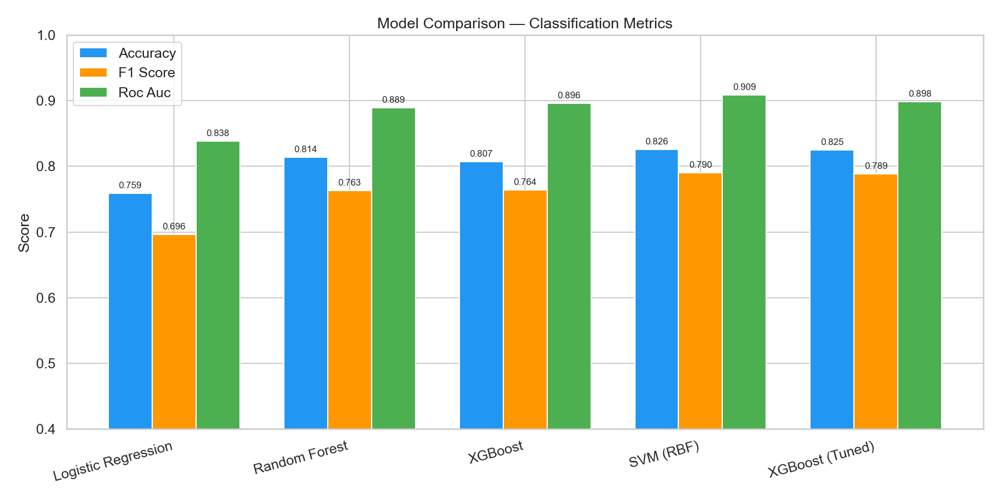
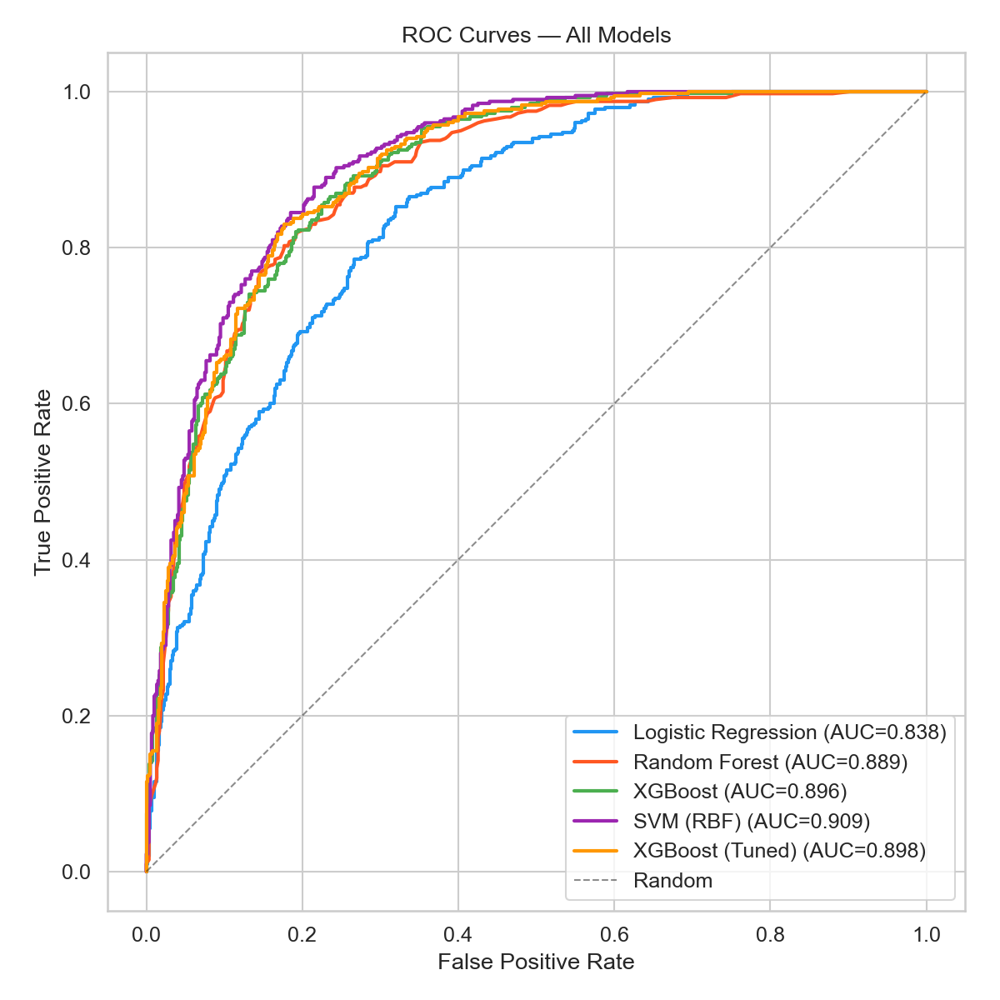
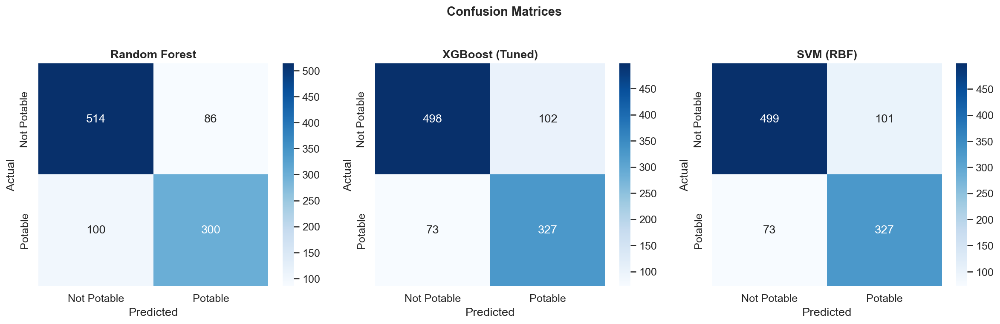
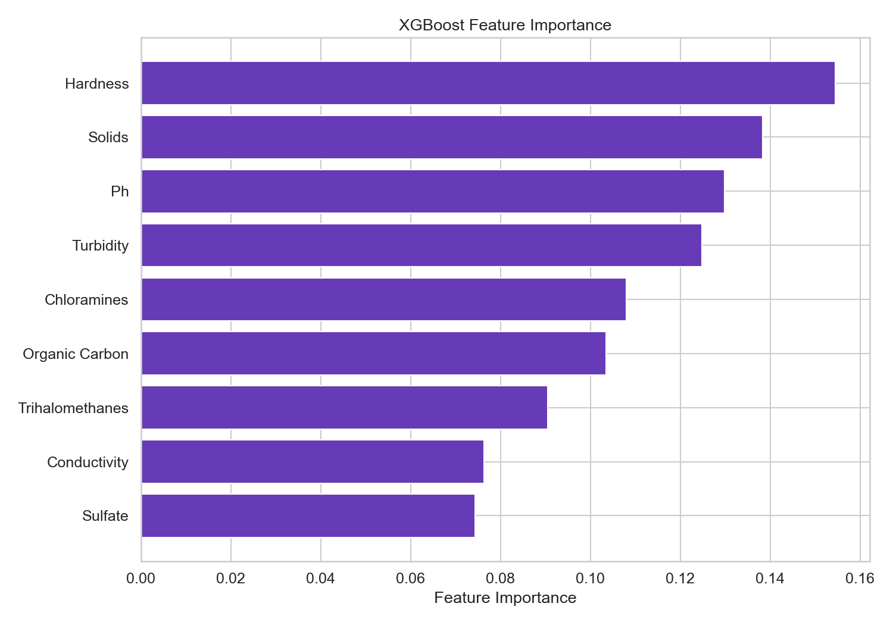
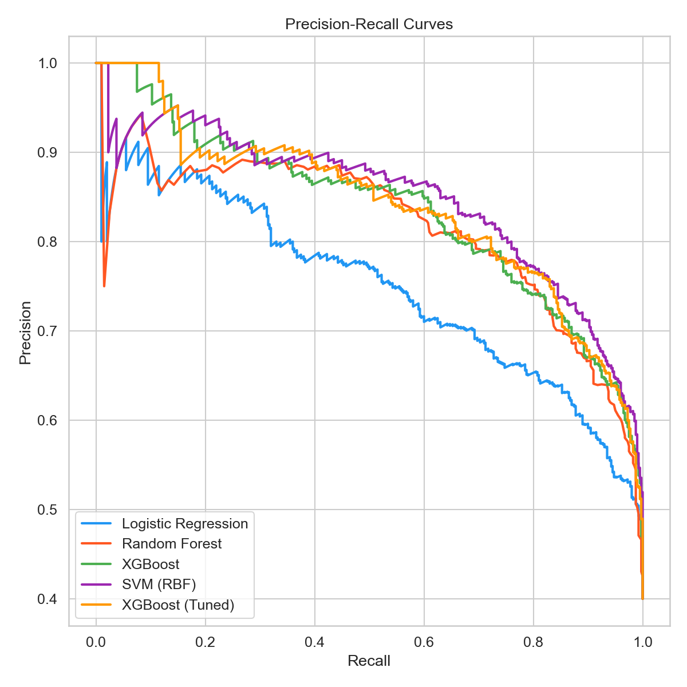

# ML Water Quality Classification

End-to-end machine learning pipeline for water potability prediction. Compares Logistic Regression, Random Forest, XGBoost, and SVM classifiers with hyperparameter tuning, cross-validation, and comprehensive evaluation.

## Results

| Model | Accuracy | F1 Score | ROC-AUC |
|-------|----------|----------|---------|
| Logistic Regression | 0.759 | 0.696 | 0.838 |
| Random Forest | 0.814 | 0.763 | 0.889 |
| XGBoost | 0.807 | 0.764 | 0.896 |
| SVM (RBF) | **0.826** | **0.790** | **0.909** |
| XGBoost (Tuned) | 0.825 | 0.789 | 0.898 |

### Feature Distributions by Class



### Feature Correlation Matrix



### Model Comparison



### ROC Curves



### Confusion Matrices



### Feature Importance (XGBoost)



### Precision-Recall Curves



## Dataset

5,000 water samples with 9 physicochemical features based on WHO water quality parameters:

| Feature | Description | Unit |
|---------|-------------|------|
| pH | Acidity/alkalinity | - |
| Hardness | Calcium + Magnesium content | mg/L |
| Solids | Total dissolved solids | mg/L |
| Chloramines | Disinfectant concentration | ppm |
| Sulfate | Sulfate ion concentration | mg/L |
| Conductivity | Electrical conductivity | uS/cm |
| Organic Carbon | Organic contaminants | mg/L |
| Trihalomethanes | Disinfection byproducts | ug/L |
| Turbidity | Water clarity | NTU |

**Target**: Potability (1 = safe to drink, 0 = not safe)
**Class distribution**: 60% not potable, 40% potable
**Missing values**: ~7% in pH, sulfate, trihalomethanes

## Pipeline

1. **Data Preprocessing**: Median imputation for missing values, StandardScaler normalization (for LR and SVM)
2. **Model Training**: 4 classifiers with scikit-learn pipelines
3. **Cross-Validation**: 5-fold stratified CV on training set
4. **Hyperparameter Tuning**: GridSearchCV for XGBoost (27 parameter combinations)
5. **Evaluation**: Accuracy, F1, ROC-AUC, confusion matrix, precision-recall curves
6. **Feature Importance**: XGBoost feature importance ranking

## Project Structure

```
.
├── src/
│   ├── generate_data.py   # Synthetic water quality data generation
│   └── pipeline.py        # Full ML pipeline (preprocessing → evaluation)
├── data/
│   └── water_quality.csv  (generated, not tracked)
├── results/
│   ├── figures/           # 7 visualization plots
│   ├── model_results.json # All model metrics
│   ├── classification_report.txt
│   └── best_model_xgboost.pkl
├── requirements.txt
└── README.md
```

## How to Run

```bash
pip install -r requirements.txt
python src/generate_data.py
python src/pipeline.py
```

## Tech Stack

- **scikit-learn** — Pipelines, preprocessing, models, evaluation
- **XGBoost** — Gradient boosted trees
- **pandas / NumPy** — Data manipulation
- **matplotlib / seaborn** — Visualization
- **joblib** — Model serialization

## License

MIT
