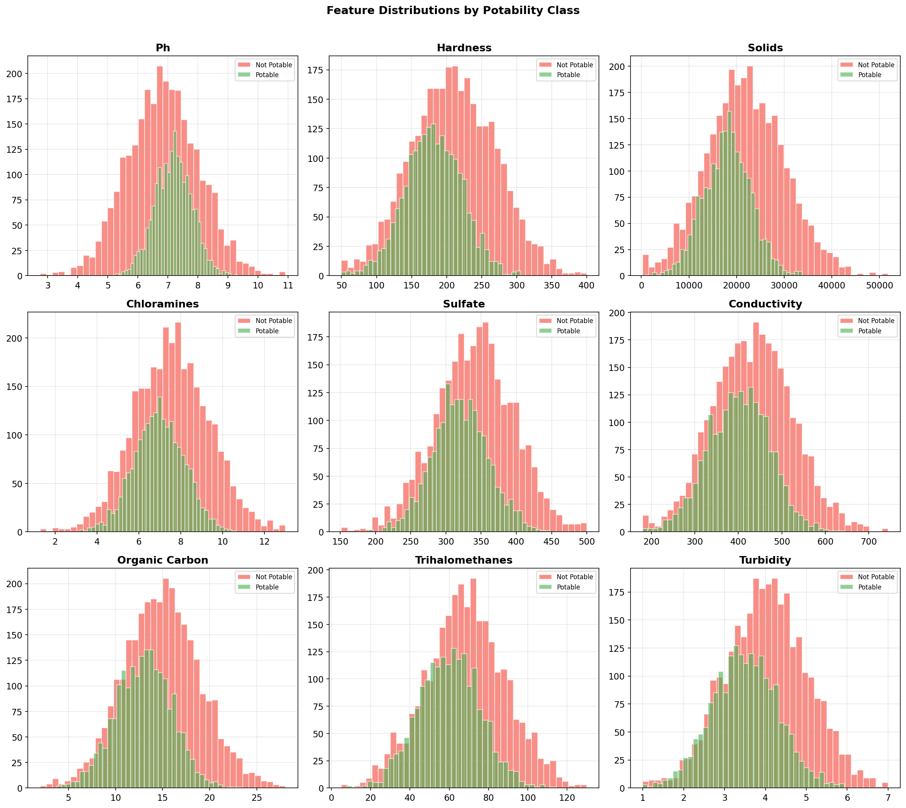
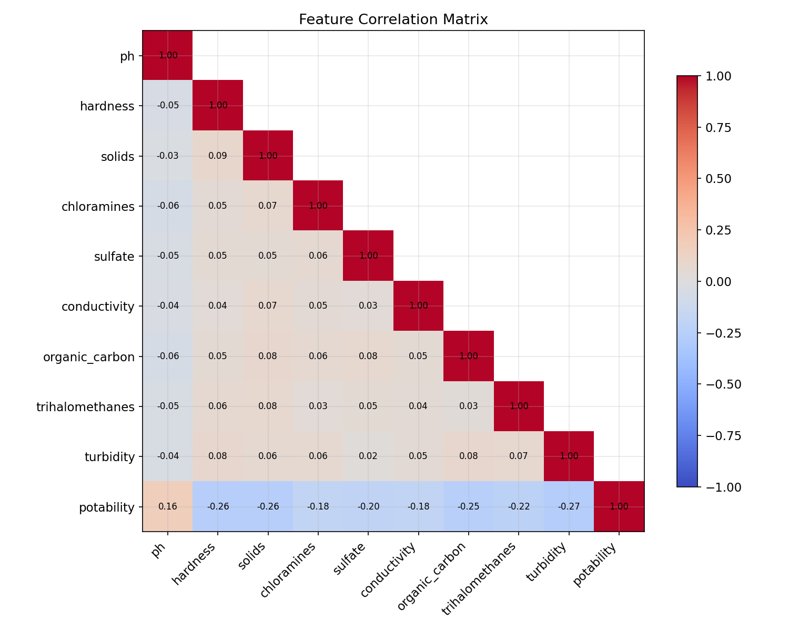
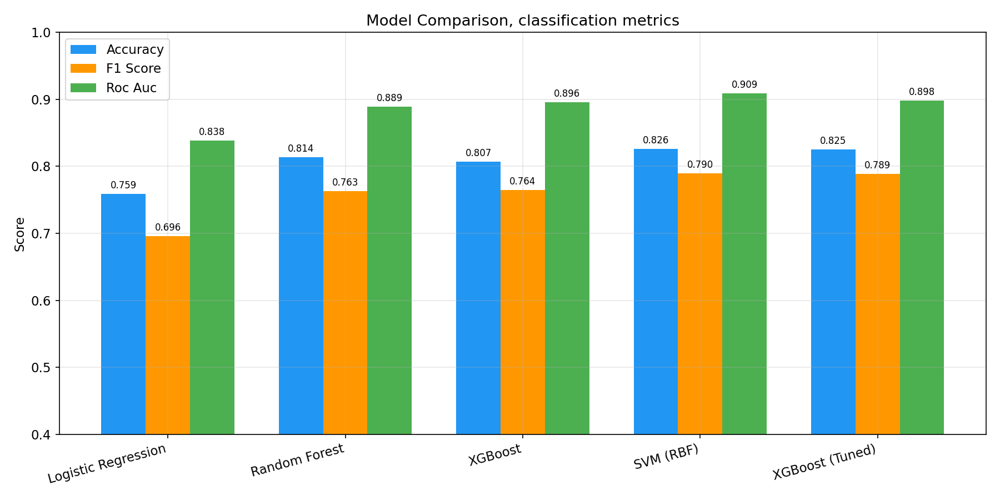
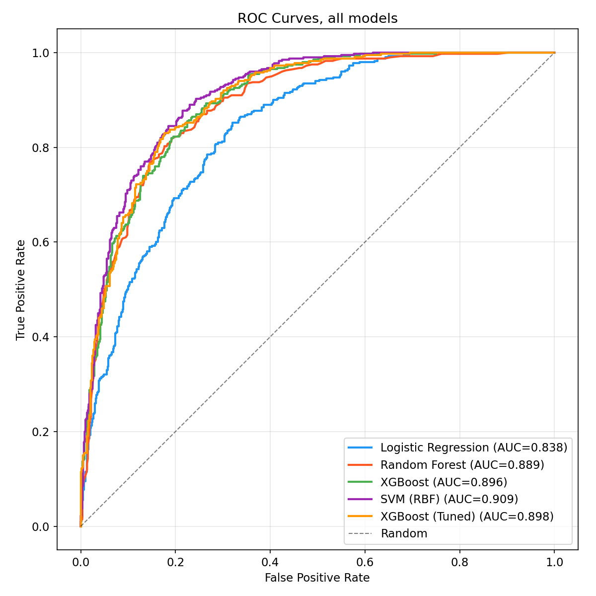
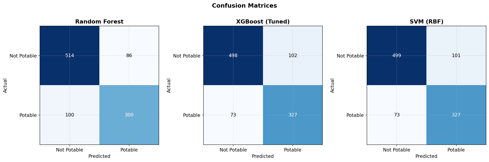
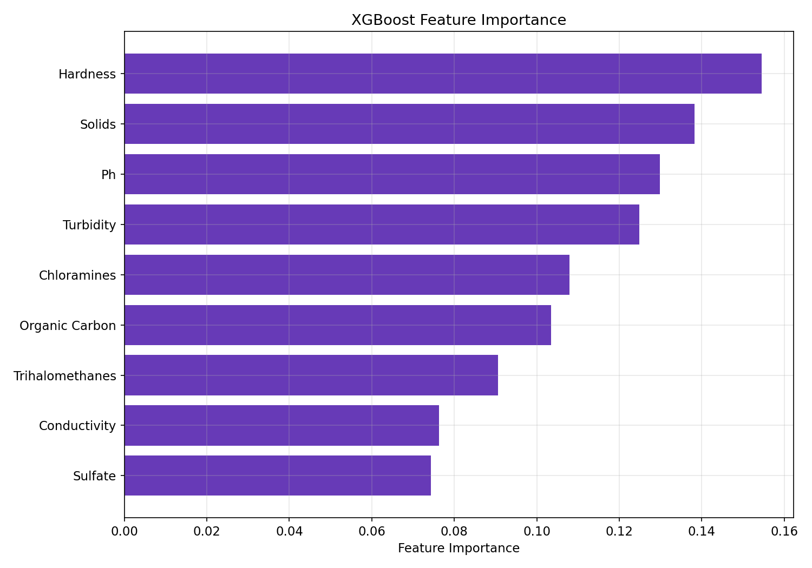
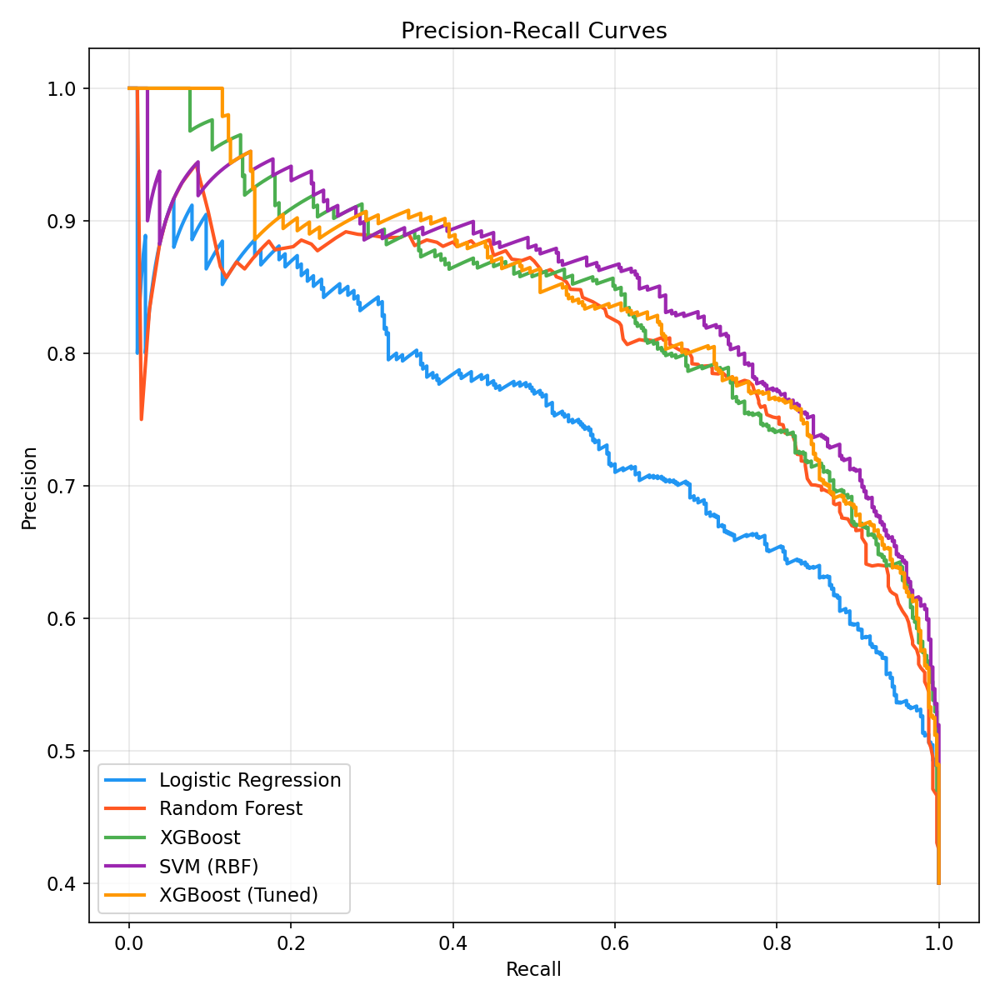

# ML Water Quality Classification

An end-to-end **synthetic-data** classification demonstration. It compares Logistic Regression, Random Forest, XGBoost, and SVM pipelines with cross-validation, hyperparameter tuning, and visual evaluation.

> **Important:** labels and features are generated by `src/generate_data.py`; they are not laboratory measurements or public-health records. This repository does not predict whether real water is safe to drink and must not be used for water-quality or regulatory decisions.

## Reference results

The metrics below are tracked outputs from the seeded, generated 5,000-sample dataset. They measure how well models recover the generator's deliberately class-correlated distributions, not real-world potability performance.

| Model | Accuracy | F1 Score | ROC-AUC |
|-------|----------|----------|---------|
| Logistic Regression | 0.759 | 0.696 | 0.838 |
| Random Forest | 0.814 | 0.763 | 0.889 |
| XGBoost | 0.807 | 0.764 | 0.896 |
| SVM (RBF) | **0.826** | **0.790** | **0.909** |
| XGBoost (Tuned) | 0.825 | 0.789 | 0.898 |

### Feature Distributions by Class



### Feature Correlation Matrix



### Model Comparison



### ROC Curves



### Confusion Matrices



### Feature Importance (XGBoost)



### Precision-Recall Curves



## Generated dataset

5,000 generated samples with 9 illustrative physicochemical feature distributions. The values are inspired by commonly reported water-quality units, but are not a standards-compliant representation of WHO, EPA, or any other authority's criteria.

| Feature | Description | Unit |
|---------|-------------|------|
| pH | Acidity/alkalinity | - |
| Hardness | Calcium + Magnesium content | mg/L |
| Solids | Total dissolved solids | mg/L |
| Chloramines | Disinfectant concentration | ppm |
| Sulfate | Sulfate ion concentration | mg/L |
| Conductivity | Electrical conductivity | uS/cm |
| Organic Carbon | Organic contaminants | mg/L |
| Trihalomethanes | Disinfection byproducts | ug/L |
| Turbidity | Water clarity | NTU |

**Target**: Synthetic class label (1 = generated positive class, 0 = generated negative class)
**Class distribution**: 60% not potable, 40% potable
**Missing values**: ~7% in pH, sulfate, trihalomethanes

## Pipeline

1. **Data Preprocessing**: Median imputation for missing values, StandardScaler normalization (for LR and SVM)
2. **Model Training**: 4 classifiers with scikit-learn pipelines
3. **Cross-Validation**: 5-fold stratified CV on training set
4. **Hyperparameter Tuning**: GridSearchCV for XGBoost (27 parameter combinations)
5. **Evaluation**: Accuracy, F1, ROC-AUC, confusion matrix, precision-recall curves
6. **Feature Importance**: XGBoost feature importance ranking

## Project Structure

```
.
├── src/
│   ├── generate_data.py   # Synthetic water quality data generation
│   └── pipeline.py        # Full ML pipeline (preprocessing → evaluation)
├── data/
│   └── water_quality.csv  (generated, not tracked)
├── results/
│   ├── figures/           # 7 visualization plots
│   ├── model_results.json # All model metrics
│   ├── classification_report.txt
│   └── best_model_xgboost.pkl
├── requirements.txt
└── README.md
```

## Reproduce the reference run

```bash
pip install -r requirements.txt
python src/generate_data.py
python src/pipeline.py
```

`generate_data.py` uses seed 42 by default. The pipeline overwrites the generated CSV and reference artifacts under `results/`. Model versions can affect the exact metrics.

To use a real dataset, supply a separate, authorized CSV with the documented feature columns and target, then independently validate sampling, label definitions, leakage controls, calibration, fairness, and external performance. Do not relabel its outputs as this repository's reference results.

## Tech Stack

- **scikit-learn** — Pipelines, preprocessing, models, evaluation
- **XGBoost** — Gradient boosted trees
- **pandas / NumPy** — Data manipulation
- **matplotlib / seaborn** — Visualization
- **joblib** — Model serialization

## Verification

```bash
python scripts/check_repository.py
```

## License

MIT. See [LICENSE](LICENSE).
