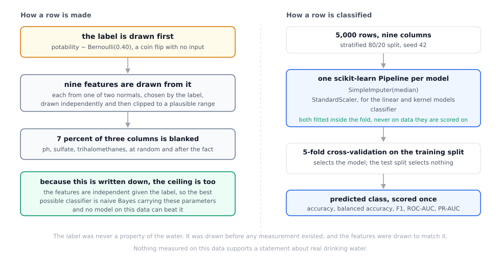
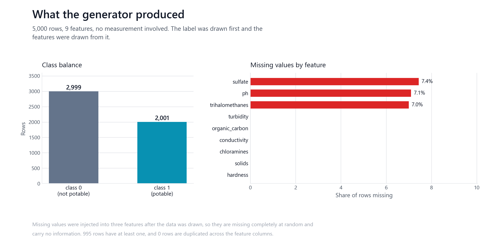
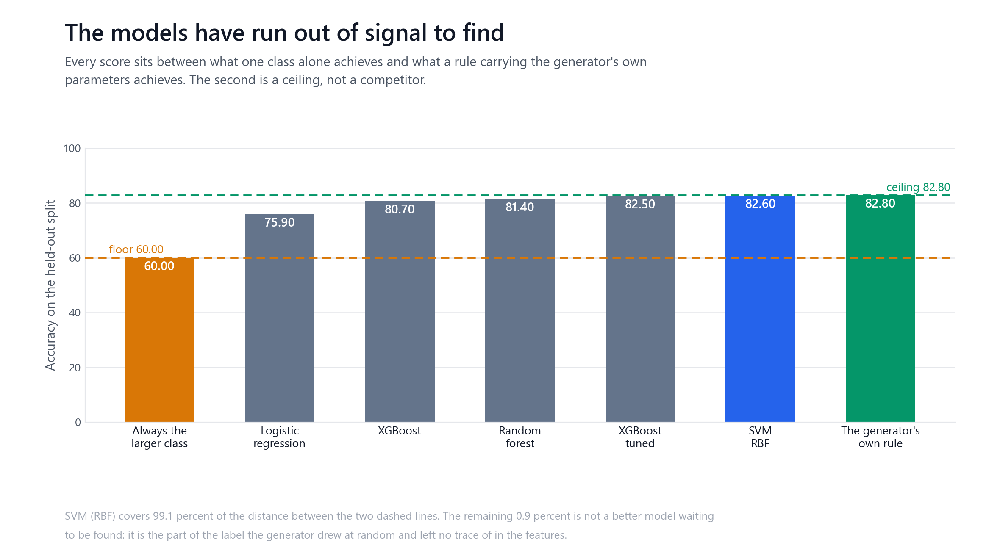
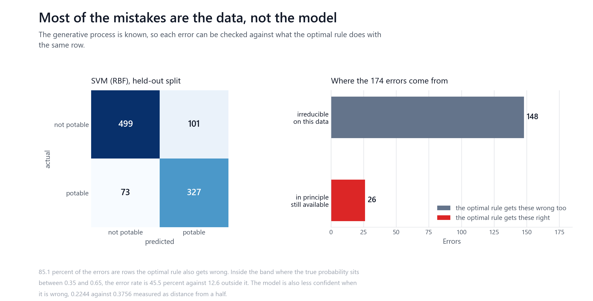

# A classification benchmark where the ceiling is known

This repository trains five classifiers on a generated dataset and compares them.
The dataset is not measured water. `src/generate_data.py` draws the label first,
as a coin flip, and then draws nine numeric features from one of two normal
distributions chosen by that label.

That construction is what makes the repository worth keeping. Because the
generating process is written down, the best accuracy any classifier could reach
is computable rather than guessed, and every score can be read against it. The
answer is that the models have essentially finished: the selected one reaches
99.1 percent of the distance between predicting one class and knowing the
generator's own parameters.

Nothing here is about drinking water. The label was drawn before any feature
existed, so it is not a property of the water and no result below supports a
statement about water quality, safety, or regulatory compliance.



## What this project studies

One question: on a dataset whose difficulty is exactly known, how close do
standard classifiers get to the limit, and what is left over when they stop.

## The dataset

Generated by `src/generate_data.py`, seed 42. No download, no external source, no
laboratory record, and no relationship to any published water-quality dataset.

| | |
| --- | --- |
| Rows | 5,000 |
| Features | 9 numeric |
| Target | `potability`, 0 or 1 |
| Class balance | 2,999 class 0, 2,001 class 1 |
| Majority class share | 59.98 percent |
| Rows with a missing value | 995 |
| Duplicate feature rows | 0 |



### How the target is defined

This is the part that determines what everything else means.

```python
potability = rng.binomial(1, 0.40, n)          # drawn first, from nothing
ph = np.where(potability == 1,
              rng.normal(7.2, 0.6, n),          # then the features
              rng.normal(6.8, 1.2, n))
```

The label is not computed from the features, and it is not a threshold rule over
them. It is drawn independently, and the features are then drawn conditioned on
it. A model that scores well here has recovered the two sets of distribution
parameters, nothing more.

The generator's comments cite WHO and EPA figures, but no such rule is applied,
and the values produced sit far outside them. Total dissolved solids are drawn
around 18,000 to 22,000 mg/L against a WHO guideline of 1,000, and sulfate around
320 to 340 mg/L against a guideline of 250, in both classes alike. The column
names borrow the vocabulary of water chemistry; the numbers do not follow it.

### Features

Nine columns, all numeric, all drawn independently given the label. The units
below are the ones the generator's own comments name, and they describe the
intent of the column rather than a measured quantity.

| Feature | Named unit | Missing |
| --- | --- | --- |
| ph | none | 355 rows |
| hardness | mg/L | 0 |
| solids | mg/L | 0 |
| chloramines | ppm | 0 |
| sulfate | mg/L | 372 rows |
| conductivity | uS/cm | 0 |
| organic_carbon | mg/L | 0 |
| trihalomethanes | ug/L | 350 rows |
| turbidity | NTU | 0 |

Missing values are inserted after the features are drawn, at a flat 7 percent in
three columns. They are missing completely at random and carry no information, so
imputing them is a convenience rather than a modelling decision.

## Evaluation protocol

Stratified 80/20 split, seed 42, giving 4,000 training and 1,000 test rows.
Selection is by mean F1 over 5-fold stratified cross-validation on the training
split. The test split is scored once per model and selects nothing.

Every model is a scikit-learn `Pipeline` with its imputer and scaler inside it,
so both are fitted on the training fold during cross-validation and on the
training split for the final fit. Neither ever sees the data it is later scored
against. That was already correct in the original code and is unchanged.

## Results



| Model | Accuracy | Balanced | F1 | ROC-AUC | PR-AUC | CV F1 | Of available |
| --- | --- | --- | --- | --- | --- | --- | --- |
| Always the larger class | 60.00 | 50.00 | 0.00 | | | | 0.0% |
| Logistic Regression | 75.90 | 74.75 | 69.61 | 83.83 | 74.96 | 69.15 | 69.7% |
| XGBoost | 80.70 | 80.29 | 76.43 | 89.58 | 83.59 | 78.38 | 90.8% |
| Random Forest | 81.40 | 80.33 | 76.34 | 88.93 | 81.57 | 78.72 | 93.9% |
| XGBoost (Tuned) | 82.50 | 82.38 | 78.89 | 89.84 | 83.98 | 81.02 | 98.7% |
| SVM (RBF) | 82.60 | 82.46 | 78.99 | 90.89 | 84.80 | 81.71 | 99.1% |
| The generator's own rule | 82.80 | 83.04 | 79.67 | 91.54 | 86.34 | | 100.0% |

Cross-validation selects **SVM (RBF)** at 81.71 CV F1, and it also happens to
score highest on the test split. The last row is not a competitor. It is naive
Bayes carrying the generator's parameters, which is the optimal rule because the
features are drawn independently given the label.

Accuracy is reported beside balanced accuracy because a 60/40 split makes them
different claims. Predicting the larger class scores 60.00 accuracy and 50.00
balanced accuracy, which is the clearest illustration of why the first number
alone is not enough.

### The ceiling, and what it means

On this 1,000-row test split the optimal rule reaches 82.80. Over 2,000,000 fresh
draws it reaches 85.68 with a 95 percent interval of 85.63 to 85.72, so the
difference is the sampling noise of a small test split rather than a discrepancy.

The gap between the selected model and the optimal rule is 0.20 accuracy points.
There is no better model to find here. A more expensive method, a longer search,
or a larger ensemble would be competing for two tenths of a point that the
generator left as noise.

## Error analysis



The selected model makes 174 errors on 1,000 held-out rows: 73 false negatives
and 101 false positives.

**148 of those 174, or 85.1 percent, are rows the optimal rule also gets wrong.**
Only 26 are errors a perfect model would have avoided. Inside the band where the
true posterior probability sits between 0.35 and 0.65, covering 145 rows, the
error rate is 45.5 percent; outside it, 12.6 percent.

The model is also less confident when it is wrong: 0.2244 against 0.3756,
measured as distance from a half. It is not confidently mistaken, it is uncertain
where the data is uncertain.

The features carry no strong signature at the errors. The largest standardised
shift between the errored rows and the split as a whole is 0.20 standard
deviations, on `solids`, which is not a region a rule could be written around.

A note on the false negatives, since the label is called potability: they are
misreads of a synthetic coin flip. They are not missed contamination, and nothing
in this repository would detect contamination.

## Reproducing

```bash
pip install -r requirements.txt

python -m src.generate_data                  # writes data/water_quality.csv
python -m src.ceiling                        # the limit, from 2,000,000 draws
python -m src.benchmark                      # five models, floor and ceiling
python -m src.error_analysis                 # what is left, and whether it is fixable
python -m unittest discover -s tests
python scripts/figures/generate_figures.py
python scripts/check_repository.py           # README against the recorded results
```

Every number in this README is read from `results/benchmark.json`, and
`scripts/check_repository.py` fails if the two stop agreeing.

`src/pipeline.py` is the original end-to-end script and still runs. Its five
metrics reproduce exactly, which is recorded under Provenance below.

## Limitations

The dataset is generated, so every number describes `src/generate_data.py` and
nothing else. The comparison between models is informative; the absolute values
are a property of one file.

One generated dataset, one seed, one split. The test split holds 1,000 rows, so
its accuracy carries roughly plus or minus 2.4 points of binomial noise, which is
larger than the gap between the top three models.

Only XGBoost was tuned. The other three ran at library defaults, so the tuned
result is not a like-for-like comparison and is labelled separately. The search
also selected `max_depth` 4 and `n_estimators` 100, both the smallest values in
the grid, which means the grid may not contain the optimum.

The optimal rule assumes the features are independent given the label, which the
generator makes true. On data where that failed, the same construction would give
a lower bound on the ceiling rather than the ceiling itself.

The generator clips each feature, so the true density is not normal at the
bounds, and at most 0.30 percent of values sit on a bound, in `hardness`.

There is no accelerator path here and adding one would not help. XGBoost builds
for CPU and CUDA and has no Intel XPU backend; scikit-learn's SVM and random
forest are CPU-only unless a separate Intel extension is installed, and none is a
dependency. The dataset is the size given in the table above and fits in a few
hundred kilobytes, so the whole benchmark runs in well under a minute on one
core. Both reasons stand on their own.

## Provenance

The original run's five metrics are committed in `results/model_results.json` and
were rerun during this audit. All five reproduce exactly:

| Model | Published accuracy | Recomputed | Published F1 | Recomputed |
| --- | --- | --- | --- | --- |
| Logistic Regression | 0.759 | 0.759 | 0.6961 | 0.6961 |
| Random Forest | 0.814 | 0.814 | 0.7634 | 0.7634 |
| XGBoost | 0.807 | 0.807 | 0.7643 | 0.7643 |
| SVM (RBF) | 0.826 | 0.826 | 0.7899 | 0.7899 |
| XGBoost (Tuned) | 0.825 | 0.825 | 0.7889 | 0.7889 |

What was missing was not accuracy but context: no floor, no ceiling, and no way
to tell whether 0.826 was close to the limit or far from it.

`results/best_model_xgboost.pkl` is no longer committed. It held the tuned
XGBoost rather than the model cross-validation selects, and a pickle executes on
load, so shipping one asks a reader to trust a binary in order to inspect a
repository. Running `src/pipeline.py` still writes one locally and it is now
ignored by git; `scripts/check_repository.py` fails if it is ever tracked again.

Removing it from the working tree did not remove it from history. The blob is
still reachable in commit `6d29913` and earlier, so a clone fetches it and
`git cat-file` will hand it back. Rewriting published history to excise a file
that is the author's own and was never secret is a worse trade than saying so
here. Do not unpickle it; nothing in this repository does.

## Licence

MIT. See [LICENSE](LICENSE).
